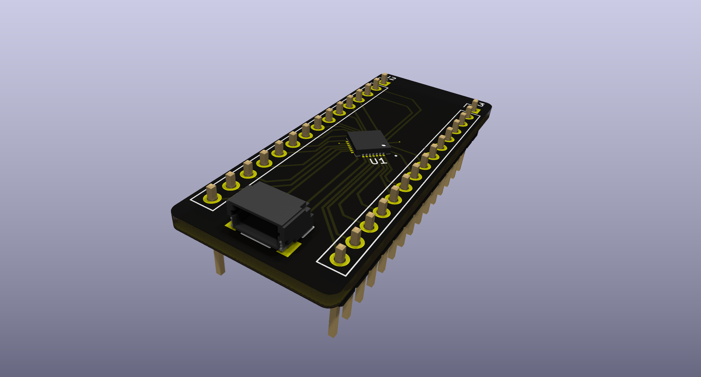

# gd32f150gx

## Overview

The project, named "gd32f150gx," is a development effort focused on creating a microcontroller-based system using the GD32F150Gx series microcontrollers with a QFN28 package. The primary objectives include real-time processing capabilities and hardware design optimization for low noise.

## Project Description

- **Description**: A test board based on GD32F150Gx microcontroller with QFN28 packaging.
- **Features**:
  - 2-layer PCB design.
  - SWD via QWIIC Connector

## Technologies and Tools

- **Hardware**: GD32, QWIIC Connector
- **Software/Hardware Design Tools**: KiCad

## Repository Structure

- `/src`: Firmware developed in C (not present in the provided structure).
- `/hardware`: Schematic and PCB design files.
  - `00_gd32f150/`: Subdirectory for specific hardware design versions.
    - KiCad project files (`.kicad_sch`, `.kicad_pcb`, etc.): Schematic and PCB layout files.
- `/assets`: Images and block diagrams.
  - `00_gd32f150.pdf`, `00_gd32f150.svg`, `gd32f150.png`
- `/docs`: General project documentation.(not present in the provided structure)

## Gallery

### Prototypes
- **Physical Prototype**: 
- **PCB Design**: 

## Installation and Usage

1. Clone the repository: `git clone [url-del-repo]`
2. Open the project in KiCad.

## License

The project is licensed under the MIT License. For more details, refer to the `LICENSE` file.